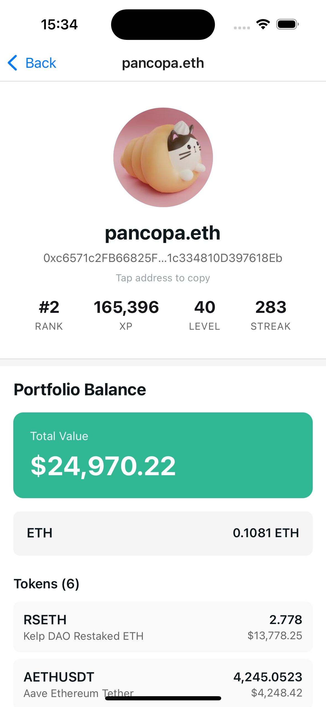

# Layer3 Leaderboard

A React Native mobile application showcasing the top users on Layer3's leaderboard with on-chain data insights.

<p align="center">
  <picture>
    <source media="(prefers-color-scheme: dark)" srcset="./images/leaderboard-dark.png" />
    <source media="(prefers-color-scheme: light)" srcset="./images/leaderboard-light.png" />
    
  </picture>
  <picture>
    <source media="(prefers-color-scheme: dark)" srcset="./images/user-dark.png" />
    <source media="(prefers-color-scheme: light)" srcset="./images/user-light.png" />
    
  </picture>
</p>

## Installation

- **Install dependencies**

  ```bash
  npm install
  ```

- **iOS Simulator (macOS)**

  ```bash
  npm run ios
  ```

- **Small iPhone Simulator (iPhone SE)**

  ```bash
  npm run ios -- --device "iPhone SE (3rd generation)"
  ```

- **iPad Simulator (iPad Pro)**

  ```bash
  npm run ios -- --device "iPad Pro (11-inch) (4th generation)"
  ```

- **Android Emulator**

  ```bash
  npm run android
  ```

- **Physical Device (iOS or Android)**
  - Install the Expo Go app from the App Store or Play Store
  - Connect your computer and phone to the same Wi-Fi network
  - Run the following command and scan the QR code with the Expo Go app

  ```bash
  npm start
  ```

- **Web Browser**

  ```bash
  npm run web
  ```

## Testing

- **Run formatting, linting, and tests**

  ```bash
  npm run check
  ```

- **Run tests with coverage**

  ```bash
  npm run test:coverage
  ```

  View coverage report at `./coverage/lcov-report/index.html`.

## Trade-offs Made

- Used [Ethplorer's](https://ethplorer.io/) default free API key for simplicity
- Caching leaderboard data in memory for now
- Limited transaction history to show only the 5 most recent transactions
- Basic error handling using simple error states with retry

## To Improve Later

- Implement React Query for caching and refetching
- Add persistent storage (AsyncStorage) and offline mode support
- Implement optimistic updates
- Add pagination for transactions and show the full transaction history
- Skeleton loading states instead of spinners
- Use AI to get extra info about users (e.g. X account, GitHub, etc.)
- E2E tests with Detox
- Real-time updates with WebSockets or polling

## Taking This to Production

- Cache static assets and IPFS content using a CDN
- Authentication (OAuth, Magic Link)
- Automated builds and tests using CI/CD pipelines
- Automate deployment to App Store/Play Store
- Write App Store/Play Store descriptions, marketing screenshots, privacy policy and terms
- In-app feedback mechanism
- Set up monitoring and alerting (e.g., Datadog)
- Crash reporting (e.g., Sentry)
- Beta testing program (TestFlight, Play Console)
- GDPR, CCPA, consent compliance and data retention policies for relevant users
- KYC and verification if needed
- Set up push notifications
